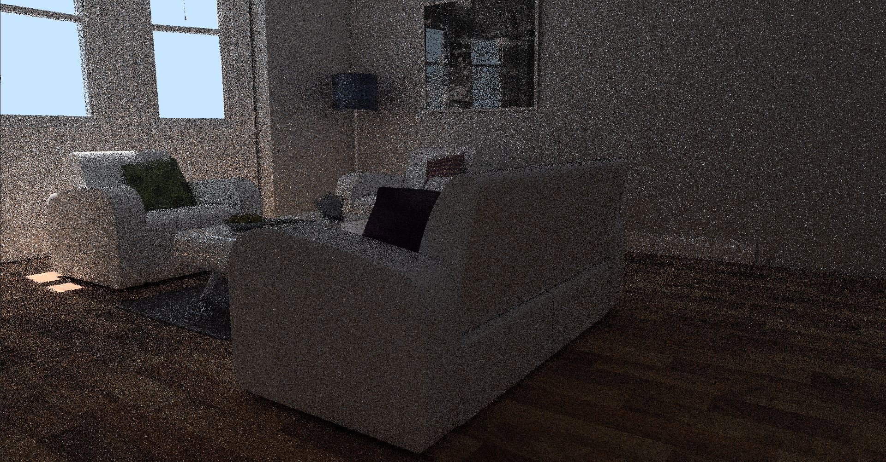
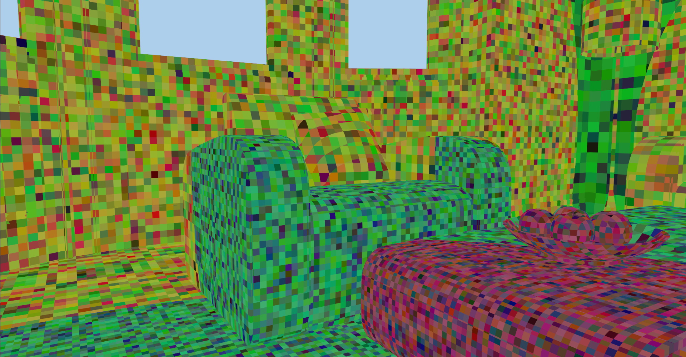
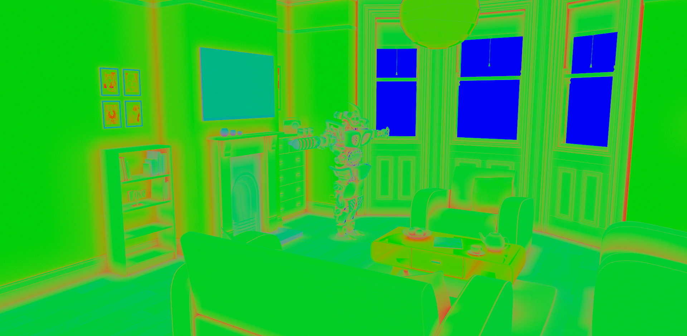
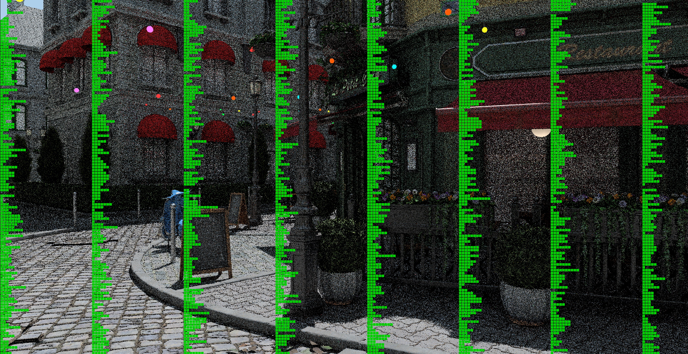

# SHaRC Integration Guide

SHaRC algorithm integration doesn't require substantial modifications to the existing path tracer code. The core algorithm consists of two passes. The first pass uses sparse tracing to fill the world-space radiance cache using existing path tracer code, second pass samples cached data on ray hit to speed up tracing.

<figure align="center">
</img>
</img>
<figcaption>Image 1. Path traced output at 1 path per pixel left and with SHaRC cache usage right</figcaption>
</figure>

## Integration Steps

An implementation of SHaRC using the RTXGI SDK needs to perform the following steps:

At Load-Time

Create main resources:
* `Hash entries` buffer - structured buffer with 64-bits entries to store the hashes
* `Voxel data` buffer - structured buffer with 128-bit entries which stores accumulated radiance and sample count. Two instances are used to store current and previous frame data
* `Copy offset` buffer - structured buffer with 32-bits per entry used for data compaction

The number of entries in each buffer should be the same, it represents the number of scene voxels used for radiance caching. A solid baseline for most scenes can be the usage of $2^{22}$ elements. Commonly a power of 2 values are suggested. Higher element count can be used for scenes with high depth complexity, lower element count reduce memmory pressure, but can result in more hash collisions.

> :warning: **All buffers should be initially cleared with '0'**

At Render-Time

* **Populate cache data** using sparse tracing against the scene
* **Combine old and new cache data**, perform data compaction
* **Perform tracing** with early path termination using cached data

## Hash Grid Visualization

`Hash grid` visualization itself doesn’t require any GPU resources to be used. The simplest debug visualization uses world space position derived from the primary ray hit intersection.

```C++
GridParameters gridParameters;
gridParameters.cameraPosition = g_Constants.cameraPosition;
gridParameters.logarithmBase = SHARC_GRID_LOGARITHM_BASE;
gridParameters.sceneScale = g_Constants.sharcSceneScale;

float3 color = HashGridDebugColoredHash(positionWorld, gridParameters);
```

<figure align="center">
</img>
</img>
<figcaption>Image 2. SHaRC hash grid vizualization</figcaption>
</figure>

Logarithm base controls levels of detail distribution and voxel size ratio change between neighboring levels, it doesn’t make voxel sizes bigger or smaller on average. To control voxel size use ```sceneScale``` parameter instead. HASH_GRID_LEVEL_BIAS should be used to control at which level near the camera the voxel level get's clamped to avoid getting detailed levels if it is not required.

## Implementation Details

### Render Loop Change

Instead of the original trace call, we should have the following four passes with SHaRC:

* SHaRC Update - RT call which updates the cache with the new data on each frame. Requires `SHARC_UPDATE 1` shader define
* SHaRC Resolve - Compute call which combines new cache data with data obtained on the previous frame
* SHaRC Compaction - Compute call to perform data compaction after previous resolve call
* SHaRC Render/Query - RT call which traces scene paths and performs early termination using cached data. Requires `SHARC_QUERY 1` shader define

### Resource Binding

The SDK provides shader-side headers and code snippets that implement most of the steps above. Shader code should include [SharcCommon.h](https://github.com/NVIDIAGameWorks/SHARC/blob/main/include/SharcCommon.h) which already includes [HashGridCommon.h](https://github.com/NVIDIAGameWorks/SHARC/blob/main/include/HashGridCommon.h)

| **Render Pass**  | **Hash Entries** | **Voxel Data** | **Voxel Data Previous** | **Copy Offset** |
|:-----------------|:----------------:|:--------------:|:-----------------------:|:---------------:|
| SHaRC Update     |        RW        |       RW       |           Read          |       RW*       |
| SHaRC Resolve    |       Read       |       RW       |           Read          |      Write      |
| SHaRC Compaction |        RW        |                |                         |        RW       |
| SHaRC Render     |       Read       |      Read      |                         |                 |

*Read - resource can be read-only*  
*Write - resource can be write-only*  

*Buffer is used if SHARC_ENABLE_64_BIT_ATOMICS is set to 0

Each pass requires appropriate transition/UAV barries to wait for the previous stage completion.

### SHaRC Update

> :warning: Requires `SHARC_UPDATE 1` shader define. `Voxel Data` buffer should be cleared with `0` if `Resolve` pass is active

This pass runs a full path tracer loop for a subset of screen pixels with some modifications applied. We recommend starting with random pixel selection for each 5x5 block to process only 4% of the original paths per frame. This typically should result in a good data set for the cache update and have a small performance overhead at the same time. Positions should be different between frames, producing whole-screen coverage over time. Each path segment during the update step is treated individually, this way we should reset path throughput to 1.0 and accumulated radiance to 0.0 on each bounce. For each new sample(path) we should first call `SharcInit()`. On a miss event `SharcUpdateMiss()` is called and the path gets terminated, for hit we should evaluate radiance at the hit point and then call `SharcUpdateHit()`. If `SharcUpdateHit()` call returns false, we can immediately terminate the path. Once a new ray has been selected we should update the path throughput and call `SharcSetThroughput()`, after that path throughput can be safely reset back to 1.0.

<figure align="center">

<figcaption>Figure 1. Path tracer loop during SHaRC Update pass</figcaption>
</figure>

### SHaRC Resolve and Compaction

`Resolve` pass is performed using compute shader which runs `SharcResolveEntry()` for each element. `Compaction` pass uses `SharcCopyHashEntry()` call.
> :tip: Check [Resource Binding](#resource-binding) section for details on the required resources and their usage for each pass 

`SharcResolveEntry()` takes maximum number of accumulated frames as an input parameter to control the quality and responsivness of the cached data. Larger values can increase the quality at increase response times. `staleFrameNumMax` parameter is used to control the lifetime of cached elements, it is used to control cache occupancy

> :warning: Small `staleFrameNumMax` values can negatively impact performance, `SHARC_STALE_FRAME_NUM_MIN` constant is used to prevent such behaviour

### SHaRC Render

> :warning: Requires `SHARC_QUERY 1` shader define

During rendering with SHaRC cache usage we should try obtaining cached data using `SharcGetCachedRadiance()` on each hit except the primary hit if any. Upon success, the path tracing loop should be immediately terminated.

<figure align="center">

<figcaption>Figure 2. Path tracer loop during SHaRC Render pass</figcaption>
</figure>

To avoid potential rendering artifacts certain aspects should be taken into account. If the path segment length is less than a voxel size(checked using `GetVoxelSize()`) we should continue tracing until the path segment is long enough to be safely usable. Unlike diffuse lobes, specular ones should be treated with care. For the glossy specular lobe, we can estimate its "effective" cone spread and if it exceeds the spatial resolution of the voxel grid then the cache can be used. Cone spread can be estimated as:

$$2.0 * ray.length * sqrt(0.5 * a^2 / (1 - a^2))$$
where `a` is material roughness squared.

## Parameters Selection and Debugging

For the rendering step adding debug heatmap for the bounce count can help with understanding cache usage efficiency.

<figure align="center">
</img>
</img>
<figcaption>Image 3. Tracing depth heatmap, left - SHaRC off, right - SHaRC on (green - 1 indirect bounce, red - 2+ indirect bounces)</figcaption>
</figure>

Sample count uses SHARC_SAMPLE_NUM_BIT_NUM(18) bits to store accumulated sample number.
> :note: `SHARC_SAMPLE_NUM_MULTIPLIER` is used internally to improve precision of math operations for elements with low sample number, every new sample will increase the internal counter by 'SHARC_SAMPLE_NUM_MULTIPLIER'.

SHaRC radiance values are internally premultiplied with `SHARC_RADIANCE_SCALE` and accumulated using 32-bit integer representation per component.

> :note: [SharcCommon.h](https://github.com/NVIDIAGameWorks/SHARC/blob/main/include/SharcCommon.h) provides several methods to verify potential overflow in internal data structures. `SharcDebugBitsOccupancySampleNum()` and `SharcDebugBitsOccupancyRadiance()` can be used to verify consistency in the sample count and corresponding radiance values representation.

`HashGridDebugOccupancy()` should be used to validate cache occupancy. With a static camera around 10-20% of elements should be used on average, on fast camera movement the occupancy will go up. Increased occupancy can negatively impact performance, to control that we can increase the element count as well as decrease the threshold for the stale frames to evict outdated elements more agressivly.

<figure align="center">
</img>
<figcaption>Image 4. Debug overlay to visualize cache occupancy through HashGridDebugOccupancy()</figcaption>
</figure>

## Memory Usage

```Hash entries``` buffer, two ```Voxel data``` and ```Copy offset``` buffers totally require 352 (64 + 128 * 2 + 32) bits per voxel. For $2^{22}$ cache elements this will require ~185 MBs of video memory. Total number of elements may vary depending on the voxel size and scene scale. Larger buffer sizes may be needed to reduce potential hash collisions.